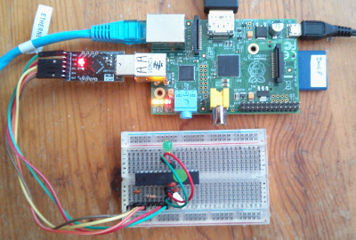

# tworse

## Morse display for Twitter Streams

This project uses a Raspberry Pi and an Arduino or Shrimp to monitor tweets and display them as Morse Code.

The Pi requires py-serial and twython.

Install the Python script in a directory of your choice.

You will also need credentials(an application key and secret) to search twitter,
which you can obtain from [the twitter dev site]()

The Python code uses Oauth2; once you have an application key and secret,
create a file called twitter.ini in a (new) sub-directory called secrets.

The file should look like this:

    # key and secret for using twitter API
    KEY=your application key here
    SECRET=your secret here
    
You will also need to install morse_complete.ino on the Shrimp or Arduino.

The Shrimp's CP2012 should be connected to a USB port on the Pi.

An Arduino should be connected to the Pi via a standard USB cable.

You may need to change the port used by the Arduino interface, depending on the hardware and
Operating System you are using.

I have had limited success using the Shrimp's CP2012 with recent versions of OS/X.
If you are a Mac user you may prefer to use an Arduino.

## Blog posts

I've made a couple of blog posts about this project.

[Introduction](http://blog.rareschool.com/2015/02/tweeting-morse-code-with-raspberry-pi.html)
[Update](http://blog.rareschool.com/2015/03/shrimp-and-raspberry-pi-run-morse.html)