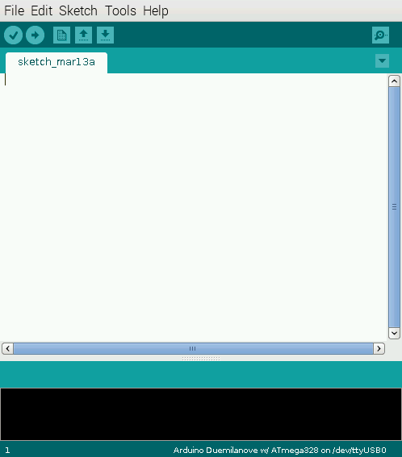
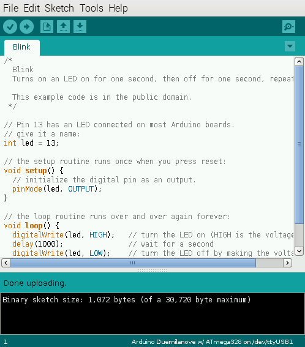
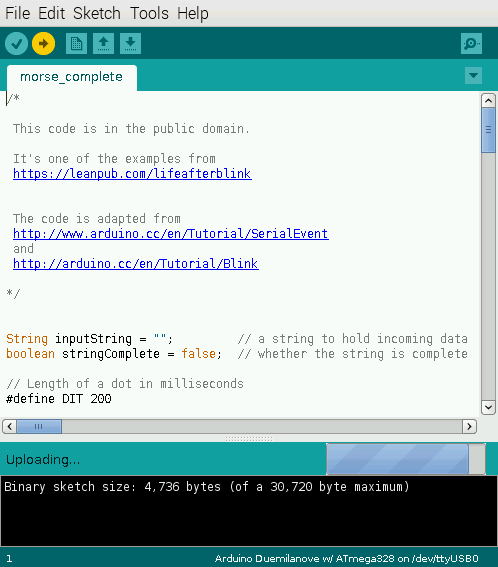
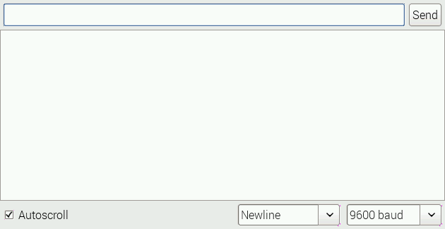
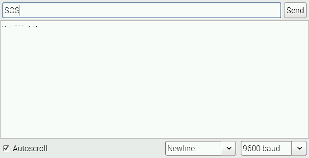
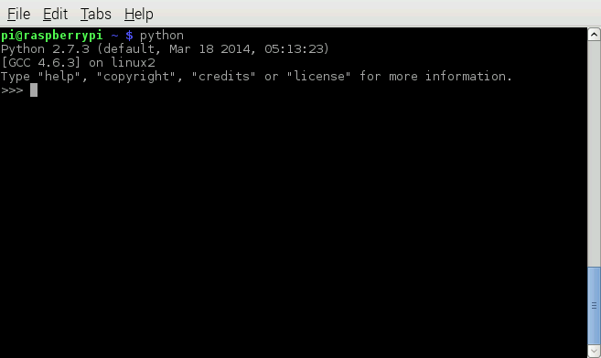

# Tworse - Twitter in Morse Code

## Introduction

The application reads tweets containing a specified hashtag or search term and displays them in Morse code.

It makes use of the Arduino's real-time processing and the huge library of open source software that can run on the Pi.

### What you'll do

1. You'll start by installing the Arduino IDE on the Pi, and use that to upload the Morse flasher program to the Arduino.
1. Next you will use the Serial Monitor to check that the Arduino sketch is working as expected.
1. Once that's working, you'll install and test *PySerial*, a Python program that can drive the Pi's serial port.
1. Next you'll install and configure *twython*, a Python package that can be used to interact with twitter.
1. Finally you will write a short Python script that searches Twitter and sends the tweets it finds over the serial
connection to the Arduino.

### What you'll need

1. A Raspberry Pi Model B, B+ or Pi 2 with a recent version of Raspbian installed
1. A Keyboard
1. A Mouse
1. A monitor with HDMI cable
1. A 5v 1A power supply
1. If you're using a Model B or B+, a powered, Pi-compatible USB hub
1. An Ethernet connection, wireless or wired.
1. Access to a twitter account so yu can send some test tweets.
1. A zip file with the code for the Morse Flasher. (It also has a completed version of the Python script).
You can [click here to download it](https://github.com/romilly/tworse/blob/master/zip/tworse.zip).
and one of

- An Arduino UNO with an A to B USB cable
- A Shrimp with its CP2102 programmer

If you haven't heard of the Shrimp, it's a low-cost Arduino clone that you can build yourself on a breadboard.
If you would like to make one, I've published an e-book called
[*Making the Shrimp*](https://leanpub.com/makingtheshrimp)
with step-by-step instructions.

Let's get started on the tworse project!

## Installing the Arduino IDE

If you haven't got the Arduino IDE installed on your Pi, now is the time to do it.

From the command line or a terminal window, type

    sudo apt-get update
    sudo apt-get update
    sudo apt-get install arduino
   
The installation will take several minutes. At the time of writing, the Arduino version in the Raspbian repository is
quite old (1.0.1). While that means it won't work with the more recent Arduino boards, it will work with the Uno and
the Shrimp.

The instructions that follow generally apply to both the Arduino Uno and the Shrimp.
If you need to do different things with Arduino and Shrimp the instructions will make this clear.

### Connecting the Pi and Arduino

This is really simple!

1. If you're using an Arduino Uno, connect the USB cable from a free USB socket on the Pi to the USB port on the Arduino
1. If you're using a Shrimp, plug the CP2102 programmer into a spare USB socket on the Pi.

## Upload the Morse sketch to the Arduino

### Start up the Arduino IDE

If you've been using the command line, start the window manager by typing

    startx
    
Once you can see the desktop, look in the  application menu under Electronics and click on *Arduno IDE*.

The Arduino IDE should start; you'll see a screen like this:

### Check that the Arduino or Shrimp is visible to the IDE

Under `Tools/Serial Port` check that you can see `/dev/tty/ACM0` if you're using an Arduino, or`/dev/ttyUSB0`
if you're using a Shrimp.

### Set the correct board type

Whether you are using an Arduino Uno or Shrimp, make sure the `file/board type` is set to Arduino Uno

### Check it out

Open the Blink sketch `File/Examples/01.Basics/Blink` and upload it to the Arduino or Shrimp.

If you see a message 'done uploading' as in the image below all is well.

### Upload and test

Download the [tworse project zip file](https://github.com/romilly/tworse/blob/master/zip/tworse.zip)

If you haven't done so already and unzip it in the directory of your choice.

From the Arduino IDE, open the file morse_complete.ino and upload the file.

Open the Serial Monitor, check the baud rate is 600 and set the line terminator to Newline.

In the Serial Monitor text entry field, type SOS and press return.

You should see three short, three long and three short flashes of the onboard LED, and the Serial Monitor should
display the Morse code as dots and dashes.

## Using PySerial

Since you want to send tweets from the Pi to the Arduino, yu need some way of sending data over the Serial link from
within a program. The software you will use is called PySerial.

In a Raspberry Pi command window, type

    sudo apt-get install python-serial 
    
You can do a very quick test to verify the installation.

In a command window, type

    python
    
You should see an Python interactive window.
 

Enter the following, one line at a time

**NB:** If you are using a Shrimp, replace `'/dev/ttyACM0'` with `'/dev/ttyUSB0'`in the second line below.

    import serial
    port='/dev/ttyACM0'
    ser = serial.Serial(port, 9600)
    ser.write('SOS\n')

The last line will print the number 4, to show that 4 characters have been  transmitted - *SOS* and a newline.
You should see the LED flash - three short flashes, three long flashes, and three shirt flashes.

In the Python session, type

    ser.readline()
    
You should see the dot-and-dash text version Morse code of your message displayed.

Close the python session by typing `exit()`.

## Using twython

There are several Python packages that can interact with Twitter through the Twitter API.
We'll be using [twython](https://twython.readthedocs.org/en/latest/)

### Using The Twitter API

These days, any application that wants to use the Twitter API must use credentials to identify who is asking for access.
Credentials specify who you claim to be and offer proof in the form of a secret, like a password)

In addition, Twitter limits the number of API requests that a user can make in a given time period.

Applying for your own Twitter Credentials is easy but a little time-consuming, and you need to have your own Twitter
account to apply.

<!-- TODO: add note to clarify what to do in the book version --> 

To keep things simple and save time, you'll be given credentials that you can use during the workshop.

**Please don't abuse them.** 

If you make too many requests, **you and all the others will be locked out of the Twitter API**
temporarily or permanently.

That shouldn't happen if you use the code described below.

### Installing twython

<!-- TODO: add details -->

### Testing twython

Send a test tweet with the hashtag #morsetweeter

Re-open an interactive Python session , and type the following, one line at a time:

    from credentials import parse
    from twython import Twython
    ini = parse('secrets/twitter.ini')
    key = ini['KEY']
    secret = ini['SECRET']
    tw = Twython(key, secret, oauth_version=2)
    twitter = Twython(key, access_token=tw.obtain_access_token())
    tweets = twitter.search(q='#morsetweeter')
    for status in tweets['statuses']:
        print status['text']

You should see your tweet among any others people have sent with the hashtag.

Here's how it works:

    from credentials import parse
    from twython import Twython

imports a litle helper function called `parse` which can read yourTwitter credentials from a file, and imports the
Twython class from the twython pacakge so you can use them in your program.

    ini = parse('secrets/twitter.ini')
    key = ini['KEY']
    secret = ini['SECRET']
    
uses `parse` to read a credentials file called `twitter.ini` from the `secrets` directory and extracts the API key
and the secret (or password).

    tw = Twython(key, secret, oauth_version=2)
    twitter = Twython(key, access_token=tw.obtain_access_token())
    
authenticates you using the credentials provided.

    tweets = twitter.search(q='#morsetweeter')
    
sends a request to Twitter asking for all the recent tweets containing the hashtag #morsetweeter.

    for status in tweets['statuses']:
        print status['text']
        
iterates through the list of tweets, extracting the status and printing its text in the interactive Python window.

That's it!

## Putting it all together

The final stage is to link up the code that reads tweets with the code that sends data to the Modse Flasher.

You can probably do that yourself, but if you get stuck there's a working solution in the Python directory.

It's called `twython-reader.py`and if you change to the python sub-directory of the place where you unzipped 
`tworse.zip`you can run it by typing `'python tworse.zip`.

**NB:** Don't do this too often or you'll breach Twitter's API rate limits!

## What next?

The credentials you've used in the workshop will stop working once the worksop is over. If you want to continue to use
the code, you'll need to get your own credentials and plug thm in. You'll find details of how to do this in Appendix A.

I'd appreciate some feedback about the workshop. 
There's an on-line survey which should take you no more than 5 minutes to complete.
That will help me to improve this and other workshops in the future. Please
[complete it right now](https://www.surveymonkey.com/s/LCQXSFZ) while the workshop is
fresh in your mind.
 
## Appendix A
