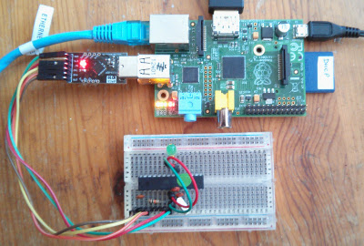

# Twitter Morse Workshop

## Introduction

In this short workshop, you will build a tweet display using a Raspberry Pi and an Arduino or Shrimp.

If you haven't come across the Shrimp before, it's an inexpensive Arduino clone on a breadboard that
you can build yourself. There's information about how to build your onw Shrimp in the resources section
at the end of these notes.

The Raspberry Pi will monitor Twitter, looking for tweets containing a particular hashtag.

It will send each tweet to the Arduino or Shrimp, which will display the tweet in Morse Code using the on board LED.

In the text which follows, we'll refer to the Shrimp,
but it's fine if you're using an Arduino.

Sometimes you'll need to do slightly different things for an Arduino but
the instructions will make that clear.

The workshop consists of a series of simple steps.

You'll

- install the Arduino IDE if you have not done so already
- install the Morse Sketch on the Shrimp
- test the sketch using minicom
- drive the sketch using python
- set up the python script to search twitter and send tweets to the Shrimp

There will be a short review at the end of the workshop.

## Install the Arduino IDE on the Pi

From a terminal window or the command line, type

    sudo apt-get update
    sudo apt-get upgrade
    sudo apt-get install arduino
    
The installation will take several minutes.

## Install the Morse Sketch on the Shrimp

If you're using a Shrimp, plug the CP2102 programmer into one of the USB sockets on the Pi.

If you're using and Arduino, connect the Pi and the Arduino using a USB cable.

